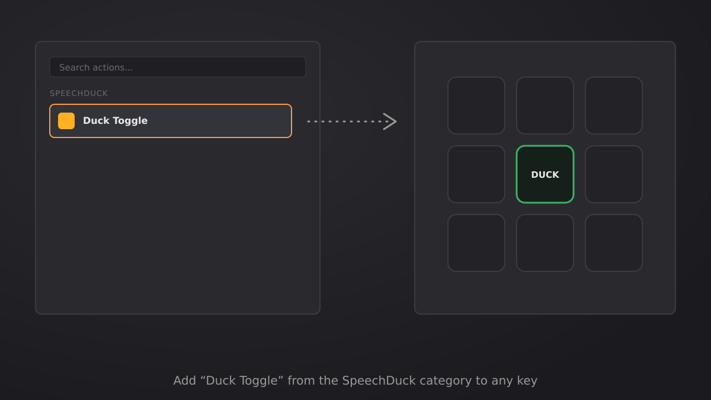
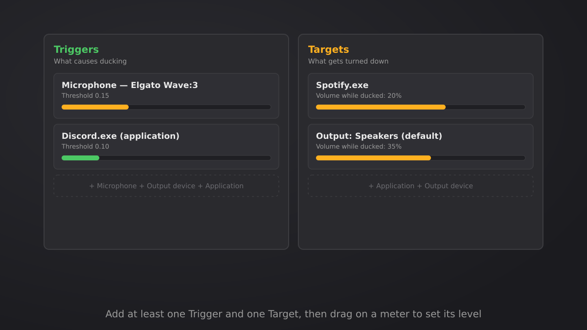
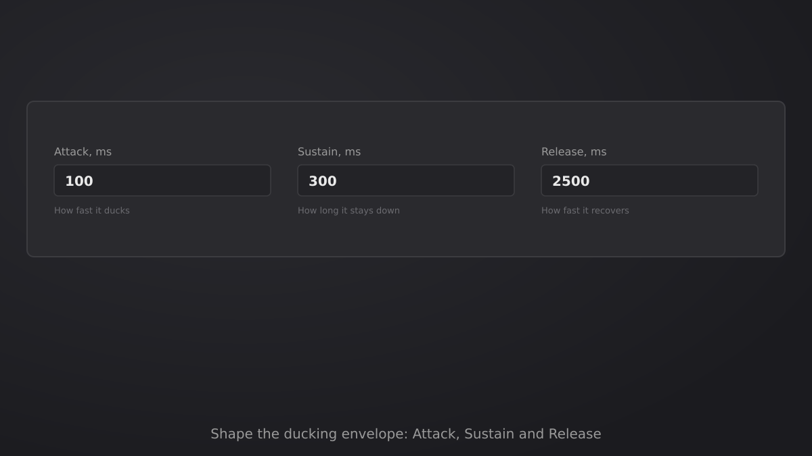
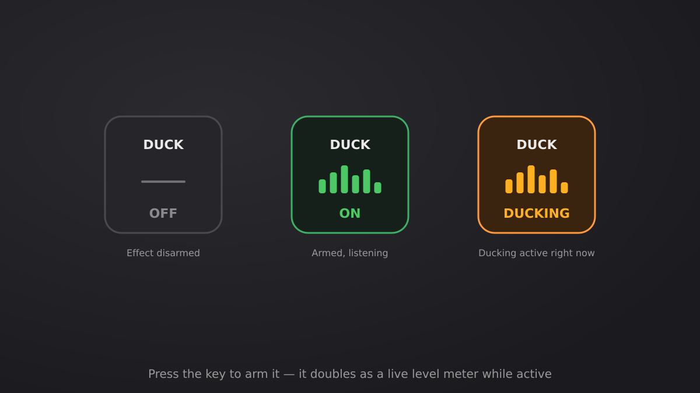

# SpeechDuck — Setup Guide

A short walkthrough for getting SpeechDuck running: add the action, tell it what should trigger ducking and what should get turned down, tune the timing, then arm it.

## 1. Add the action to a key

Open Stream Deck's action list, find **SpeechDuck → Duck Toggle**, and drag it onto any key.

## 2. Add Triggers and Targets

Open the key's settings (Property Inspector).

- **Triggers** are what causes ducking — a microphone, an output device, or a specific application. Add at least one.
- **Targets** are what gets turned down while a trigger is active — an application or an output device, each with its own "volume while ducked" level. Add at least one.

Every trigger and target shows a live level meter — drag directly on the bar to set its Threshold (triggers) or ducked Volume (targets), instead of typing numbers.

## 3. Shape the envelope

Still in the settings panel, adjust:

- **Attack** — how fast a target drops to its ducked volume once a trigger fires.
- **Sustain** — how long it stays fully ducked after the trigger drops quiet, before release starts (prevents flutter during pauses in speech).
- **Release** — how fast a target returns to its original volume once sustain ends.

The defaults (100 / 300 / 2500 ms) work well for normal speech — shorten Release if you want volume back up faster between sentences.

## 4. Arm it and watch it work

Press the key once to arm the effect. While armed, the same key becomes a live meter, and cycles through three states:

- **OFF** — disarmed, nothing happens.
- **ON** — armed and listening, showing your trigger levels in real time.
- **DUCKING** — a trigger just crossed its threshold; targets are turned down right now.

Press the key again any time to disarm the effect.

## Troubleshooting

- **Nothing happens when I speak** — check that your microphone's Threshold isn't set too high; drag it lower on the live meter while talking to find a level that reliably crosses it.
- **An app I want to duck doesn't show up** — Targets/Triggers only list apps currently in the Windows mixer; open the app once so Windows registers its audio session, then re-open the picker (an app added before it's running will still be picked up automatically once it starts).
- **Still stuck?** Open an [issue](../../issues/new/choose) — Bug report, Question/Support, or Feedback, whichever fits.
